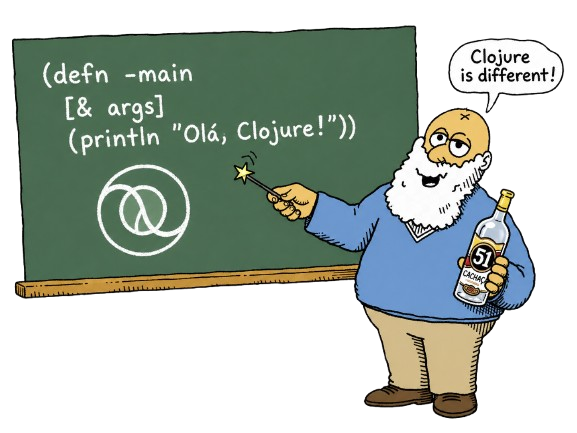

# Aprenda Clojure

  

## Índice

- [Material para aprender Clojure](#material-para-aprender-clojure)
  - [IDE online](#ide-online)
  - [Cheatsheets, Style Guides...](#cheatsheets-style-guides)
  - [Cursos e Vídeos](#cursos-e-vídeos)
  - [Prática](#prática)
  - [Livros](#livros)
  - [Podcasts](#podcasts)
- [Palestras](#palestras)
  - [Introdução e Fundamentos](#introdução-e-fundamentos)
  - [Macros](#macros)
  - [Ferramentas e REPL](#ferramentas-e-repl)
  - [ClojureScript](#clojurescript)
  - [Aplicações e Casos](#aplicações-e-casos)
  - [Paralelismo](#paralelismo)
  - [Datomic](#datomic)
  - [Desenvolvimento de Jogos](#desenvolvimento-de-jogos)
- [Ferramentas Úteis](#ferramentas-úteis)
- [Listas de Links](#listas-de-links)

## Material para aprender Clojure

### IDE online

- [JDoodle - Execute Clojure Online](https://www.jdoodle.com/execute-clojure-online/)

### Cheatsheets, Style Guides...

| Nome | Idioma |
|:--|:--:|
| [Clojure Cheat Sheet](https://clojure.org/api/cheatsheet) | 🇺🇸 |
| [The Clojure Style Guide](https://guide.clojure.style/) | 🇺🇸 |
| [Guia de Estilo de Clojure](https://github.com/cemanuelio/clojure-style-guide/blob/pt-BR/README.md) | 🇧🇷 |

### Cursos e Vídeos

#### Cursos completos

| Nome | Pago | Idioma |
|:--|:--:|:--:|
| [Clojure4Noobs](https://github.com/lanjoni/clojure4noobs) | Grátis | 🇧🇷 |
| [Alura - Trilha de Clojure](https://www.alura.com.br/formacao-clojure) | Pago | 🇧🇷 |
| [Clojure: Introdução à Programação Funcional](https://www.udemy.com/course/clojure-introducao-a-programacao-funcional/) | Pago[¹](https://twitter.com/marciofrayze/status/1683843555926630402) | 🇧🇷 |
| [Lambda Island](https://lambdaisland.com/) | Grátis[²](https://lambdaisland.com/blog/2022-04-25-making-lambda-island-free) | 🇺🇸 |
| [Animated Clojure](https://markm208.github.io/cljbook/) | Grátis | 🇺🇸 |
| [HP Indigo - Clojure course](https://cycognito.github.io/clojure-course/site/) | Grátis | 🇺🇸 |
| [Eric Normand Courses](https://ericnormand.podia.com/) | Pago | 🇺🇸 |
| [ClojureStream](https://clojure.stream/#courses) | Pago | 🇺🇸 |
| [Clojure for PROs](https://clojureforpros.com/) | Pago | 🇺🇸 |

#### Playlists e videoaulas

| Nome | Pago | Idioma |
|:--|:--:|:--:|
| [Curso de Clojure](https://www.youtube.com/playlist?list=PLWd81WfLMI-fNPUkjddIHB_taxElX3qMr) | Grátis | 🇧🇷 |
| [Clojure Básico](https://www.youtube.com/playlist?list=PLcjDvROHY58MlqcAU7d0fYhAJQ-p-dMp6) | Grátis | 🇧🇷 |
| [Pedestal e Component](https://www.youtube.com/playlist?list=PLcjDvROHY58NpVqhOyafHL8iTmGGDT9DZ) | Grátis | 🇧🇷 |
| [Pedestal com Clojure](https://www.youtube.com/playlist?list=PL39juNCZuUgwBV0big8hM4GR7gowZx0AY) | Grátis | 🇧🇷 |
| [Programação funcional básica em Clojure](https://www.youtube.com/playlist?list=PLzehOqhpwpxgbqNbz4y8vj5QYRfdflbz1) | Grátis | 🇧🇷 |
| [Playlist de Programação Funcional do Prof. Otávio Lemos](https://www.youtube.com/playlist?list=PLpJIjBkNnEt_AclkpsvdX_4YUbcks8wXJ) | Grátis | 🇧🇷 |

### Prática

| Nome | Idioma |
|:--|:--:|
| [Exercism on Clojure](https://exercism.org/tracks/clojure) | 🇺🇸 |
| [4Clojure 4ever](https://4clojure.oxal.org/) | 🇺🇸 |
| [Clojure Koans](http://clojurekoans.com/) | 🇺🇸 |
| [Casting Spells with Clojure](https://www.lisperati.com/casting.html) | 🇺🇸 |
| [Wonderland Clojure Katas](https://github.com/gigasquid/wonderland-clojure-katas) | 🇺🇸 |
| [100 Solutions](https://roboloco.net/project-euler/) of the [Project Euler](https://projecteuler.net/) in Clojure | 🇺🇸 | 

### Livros

| Nome | Autor | Gratuito para Ler Online | Idioma |
|:--|:--:|:--:|:--:|
| [Clojure for the Brave and True](https://www.braveclojure.com/) | [Daniel Higginbotham](https://twitter.com/nonrecursive) | Sim | 🇺🇸 |
| [Clojure Book](https://clojure-book.gitlab.io/) | [Karthikeyan A K](https://gitlab.com/mindaslab) | Sim | 🇺🇸 |
| [Getting Clojure: Build Your Functional Skills One Idea at a Time](https://www.amazon.com.br/gp/product/1680503006/) | [Russ Olsen](https://twitter.com/russolsen) | Não | 🇺🇸 |
| [Programming Clojure](https://www.amazon.com.br/Programming-Clojure-3e-Alex-Miller/dp/1680502468/) | [Alex Miller](https://twitter.com/puredanger) | Não | 🇺🇸 |
| [Clojure Applied: From Practice to Practitioner](https://www.amazon.com.br/Clojure-Applied-Practice-Practitioner-English-ebook/dp/B016CJGHFE) | [Ben Vandgrift](https://twitter.com/bvandgrift) | Não | 🇺🇸 |
| [The Joy of Clojure](https://www.amazon.com.br/gp/product/1617291412/) | [Michael Fogus](https://twitter.com/fogus) | Não | 🇺🇸 |
| [Programação Funcional: Uma introdução em Clojure](https://www.casadocodigo.com.br/pages/sumario-programacao-funcional-clojure) | [Gregório Melo](https://www.linkedin.com/in/gregoriomelo) | Não | 🇧🇷 |
| [Clojure Brain Teasers: Exercise Your Mind](https://pragprog.com/titles/mmclobrain/clojure-brain-teasers/) | Alex Miller e Lorilyn Jordan Miller | Não | 🇺🇸 |

### Podcasts

| Nome | Podcast | Nº | Idioma |
|:--|:--:|:--:|:--:|
| [Tecnologias no Nubank](https://www.hipsters.tech/tecnologias-no-nubank-hipsters-01/) | Hipsters | 1 | 🇧🇷 |
| [Tecnologias no Nubank: 3 anos depois](https://www.hipsters.tech/tecnologias-no-nubank-3-anos-depois-hipsters-150/) | Hipsters | 150 | 🇧🇷 |
| [Programação Funcional (e (clojure))](https://www.hipsters.tech/programacao-funcional-e-clojure-hipsters-158/) | Hipsters | 158 | 🇧🇷 |
| [Vale a pena Clojure?](https://devnaestrada.com.br/2018/02/02/vale-a-pena-clojure.html) | DEV na Estrada | 142 | 🇧🇷 |
| [Clojure com Camilo Cunha de Azevedo e Márcio Lopes de Faria](https://anchor.fm/elixiremfoco/episodes/23--Clojure-com-Camilo-Cunha-de-Azevedo-e-Mrcio-Lopes-de-Faria-e1u1kjh) | Elixir em Foco | 23 | 🇧🇷 |

## Palestras

### Introdução e Fundamentos

| Nome | Palestrante | Tags | Data | Idioma |
|:--|:--:|:--:|:--:|:--:|
| [A arte da simplicidade com Clojure](https://www.youtube.com/watch?v=_kGwRVuH6mU) | [Mauricio Szabo](https://github.com/mauricioszabo) | `fundamentos`, `simplicidade` | 10/11/2015 | 🇧🇷 |
| [A Essência do LISP](https://youtu.be/j3FEFuoVN5c) | [Sophia Velten](https://github.com/sovelten) | `lisp`, `fundamentos` | 28/10/2020 | 🇧🇷 |
| [Introdução ao LISP](https://www.youtube.com/watch?v=IIp9YaXRHVY) | [Laura Viglioni](https://github.com/Viglioni) | `lisp`, `fundamentos` | 02/12/2020 | 🇧🇷 |
| [Clojure é um Java melhor que Java](https://youtu.be/ruZwYDSaq1M) | [Ana Bastos](https://github.com/anabastos) | `jvm`, `java`, `fundamentos` | 23/04/2021 | 🇧🇷 |
| [As vantagens da linguagem funcional com Clojure!](https://youtu.be/HFGnhUQHhGE) | Heloisa Carbone | `funcional`, `fundamentos` | 22/09/2021 | 🇧🇷 |
| [Estrutura de Dados em Clojure](https://www.youtube.com/watch?v=39_0FDU4TFk) | [Rafael Ring](https://github.com/rafaelring) | `estruturas-de-dados`, `fundamentos` | 15/08/2023 | 🇧🇷 |
| [O que é Programação (Funcional)](https://www.youtube.com/watch?v=qBQau1OsgW8) | [Sophia Velten](https://www.linkedin.com/in/sovelten/) | `funcional`, `fundamentos` | 05/09/2023 | 🇧🇷 |
| [Clojure - Uma breve história (Princípios e Curiosidades)](https://www.youtube.com/live/_BsTQE-DVgo) | Heloisa Carbone | `história`, `fundamentos` | 08/08/2024 | 🇧🇷 |
| [Além das Terras de Java - Uma Introdução ao Lisp da JVM para Programação Funcional](https://youtu.be/UyN1Sw1nBbo?si=XoUslz-wpFjPR7NW) | [Eduardo Lemos](https://github.com/EduardoLR10) | `jvm`, `lisp`, `funcional` | 13/12/2024 | 🇧🇷 |
| [Introdução à Linguagem de Programação Clojure](https://youtu.be/1xSl6vC-liI) | [Nelkisa Matias](https://github.com/gabriias) | `fundamentos`, `introdução` | 12/08/2025 | 🇧🇷 |

### Macros

| Nome | Palestrante | Tags | Data | Idioma |
|:--|:--:|:--:|:--:|:--:|
| [Desmistificando Macros](https://www.youtube.com/live/tK_IR-UWgE8) | [Josué Teodoro](https://github.com/J0sueTM) | `macros`, `metaprogramação` | 17/10/2024 | 🇧🇷 |

### Ferramentas e REPL

| Nome | Palestrante | Tags | Data | Idioma |
|:--|:--:|:--:|:--:|:--:|
| [clojure-lsp: uma ferramenta de linter para tudo](https://www.youtube.com/watch?v=d-sjGfQRyHY) | [Eric Dallo](https://github.com/ericdallo) | `lsp`, `ferramentas`, `editor` | 02/05/2023 | 🇧🇷 |
| [Desenvolvimento interativo com o REPL](https://www.youtube.com/live/ntRCK_2eP3U) | [Enzzo Cavallo](https://github.com/souenzzo) | `repl`, `workflow` | 06/06/2023 | 🇧🇷 |
| [Clojure (Script, principalmente) com o editor Pulsar](https://www.youtube.com/watch?v=uZ__RWceTSA) | [Maurício Szabo](https://github.com/mauricioszabo) | `editor`, `clojurescript`, `ferramentas` | 04/07/2023 | 🇧🇷 |
| [Clojure Docs](https://www.youtube.com/live/f9LM2f7bt_4?si=sNNYBU2KSM84BqSp) | [Rafael Delboni](https://github.com/rafaeldelboni) | `documentação`, `ferramentas` | 02/05/2024 | 🇧🇷 |
| [clj-depend: Validando a arquitetura da sua aplicação](https://www.youtube.com/live/lcRqEYC-IXo) | [Fábio Domingues](https://github.com/fabiodomingues) | `arquitetura`, `ferramentas` | 20/02/2025 | 🇧🇷 |
| [Linters com clj-kondo](https://www.youtube.com/live/ILRjDZMnf1w) | [André Camargo](https://github.com/acamargo) | `lint`, `clj-kondo`, `ferramentas` | 24/04/2025 | 🇧🇷 |

### ClojureScript

| Nome | Palestrante | Tags | Data | Idioma |
|:--|:--:|:--:|:--:|:--:|
| [Construindo front-ends funcionais com ClojureScript](https://youtu.be/R1611bVKlGU) | [Isa Silveira](https://github.com/bella-silveira) | `clojurescript`, `frontend`, `funcional` | 13/11/2018 | 🇧🇷 |
| [Introdução ao ClojureScript](https://youtu.be/WcqtMSLFUHI) | [Enzzo Cavallo](https://github.com/souenzzo) | `clojurescript`, `introdução` | 04/04/2023 | 🇧🇷 |
| [Criando Scripts com NBB - Introdução a Clojure(Script)](https://www.youtube.com/live/EIUuRa7pYig) | Francisco Berrocal | `nbb`, `scripting`, `clojurescript` | 05/09/2024 | 🇧🇷 |
| [Construindo aplicações web elegantes com ClojureScript, React e UIx!](https://youtu.be/KUGStGc4E-E) | [João Lanjoni](https://github.com/lanjoni) | `clojurescript`, `react`, `uix`, `frontend` | 17/12/2025 | 🇧🇷 |

### Aplicações e Casos

| Nome | Palestrante | Tags | Data | Idioma |
|:--|:--:|:--:|:--:|:--:|
| [TODO-MVC com FullStack Clojure](https://www.youtube.com/watch?v=TPRczpkFjMw) | [Ian Fernandez](https://github.com/ianffcs) | `fullstack`, `frontend`, `backend` | 22/07/2020 | 🇧🇷 |
| [Aplicação de Técnicas de IA para Testes Unitários em Clojure](https://www.youtube.com/live/_jIyjMJDlzY) | [Raíssa Barreira](https://github.com/rtbarreira/) | `ia`, `testes` | 26/06/2025 | 🇧🇷 |
| [Introduzindo programação funcional na Carteira Digital de Trânsito](https://youtu.be/5fk0KXoQBeE) | [Marcio Frayze](https://github.com/marciofrayze) | `case`, `funcional`, `backend` | 17/12/2025 | 🇧🇷 |
| [Uma estratégia incremental com apoio IA para testes unitários em Clojure](https://youtu.be/bODFSD-GRNk) | [Raíssa Barreira](https://github.com/rtbarreira/) | `ia`, `testes` | 17/12/2025 | 🇧🇷 |
| [NuFileBox Reverse: Gestão segura de arquivos com Clojure](https://youtu.be/RtIgHpcKyqA) | [Eric Bispo](https://github.com/ericsilva200) & [Isaac Borges](https://www.linkedin.com/in/isaacsilvaborges/) | `cybersecurity`, `ffi`, `file management` | 17/12/2025 | 🇧🇷 |
| [Clojure e IA: Construindo agentes inteligentes sem reinventar a roda](https://youtu.be/PogKRQ1lJ0A) | [Marlon Silva](https://www.linkedin.com/in/marlonjsilva/) | `ia`,  `agentes`  | 17/12/2025 | 🇧🇷 |
| [Usando Clojure para Gerar Javascript para rodar Clojure que Executa Ruby (e Python)](https://youtu.be/hmsdiczfCkI?si=SDUboNNKvsuOmU_2) | [Mauricio Szabo](https://github.com/mauricioszabo) | `editores`, `chlorine`, `lazuli`, `smalltalk` | 23/03/2026 | 🇧🇷 |

### Paralelismo

| Nome | Palestrante | Tags | Data | Idioma |
|:--|:--:|:--:|:--:|:--:|
| [Paralelismo em Clojure](https://www.youtube.com/watch?v=b7cbPjsYUYY) | [Mauricio Szabo](https://github.com/mauricioszabo) | `paralelismo`, `concorrência` | 22/03/2021 | 🇧🇷 |

### Datomic

| Nome | Palestrante | Tags | Data | Idioma |
|:--|:--:|:--:|:--:|:--:|
| [Conhecendo o Datomic](https://www.youtube.com/watch?v=uGxTcHcjq78) | [Samuel Flores](https://github.com/samflores) | `datomic`, `banco-de-dados` | 02/12/2021 | 🇧🇷 |
| [Conhecendo Datomic](https://www.youtube.com/watch?v=RVA11IAXlwc) | [João Palharini](https://github.com/jpalharini) | `datomic`, `banco-de-dados` | 03/10/2023 | 🇧🇷 |

### Desenvolvimento de Jogos

| Nome | Palestrante | Tags | Data | Idioma |
|:--|:--:|:--:|:--:|:--:|
| [Desenvolvimento de Jogos com ClojureCLR](https://www.youtube.com/live/4ZU9ewFuvbc?si=LGBm0qMSboX_H8SV) | [Lucas Teles](https://github.com/lucasteles) | `jogos`, `clojureclr` | 13/06/2024 | 🇧🇷 |
| [Analisando Jogos em Clojure - Lisp Game Jam 2024](https://www.youtube.com/live/U0EwCgdAWhE?si=VJNKeNBjMDl6PMHY) | [Lucas Teles](https://github.com/lucasteles) & [Rafael Delboni](https://github.com/rafaeldelboni) | `jogos`, `game-jam` | 04/07/2024 | 🇧🇷 |
<!-- |  | - | `tag` | 00/00/2020 | 🇧🇷 | -->

## Ferramentas Úteis

| Nome | O que faz? |
|:--|:--|
| [leiningen](https://leiningen.org/) / [deps.edn](https://clojure.org/guides/deps_and_cli) | Gerenciador de dependências e ferramenta de build |
| [babashka](https://github.com/babashka/babashka) | Ambiente de scripting em Clojure |
| [cljstyle](https://github.com/greglook/cljstyle) | Ferramenta de formatação de código |
| [clj-kondo](https://github.com/clj-kondo/clj-kondo) | Ferramenta de análise estática de erros e inconsistências |
| [rebel-readline](https://github.com/bhauman/rebel-readline) | Melhor interatividade no REPL |

## Listas de Links

- [Comunidade Clojure Brasil](https://github.com/clj-br)
- [Building Nubank](https://www.youtube.com/c/NubankOntheStage)
- [Clojure: The Documentary](https://youtu.be/Y24vK_QDLFg)
- [Vagas de Clojure](https://github.com/clj-br/vagas)
- [15 anos de Clojure com o time da Cognitect](https://blog.nubank.com.br/clojure15anos/)
- [Rich Hickey Fanclub](https://github.com/tallesl/Rich-Hickey-fanclub)
